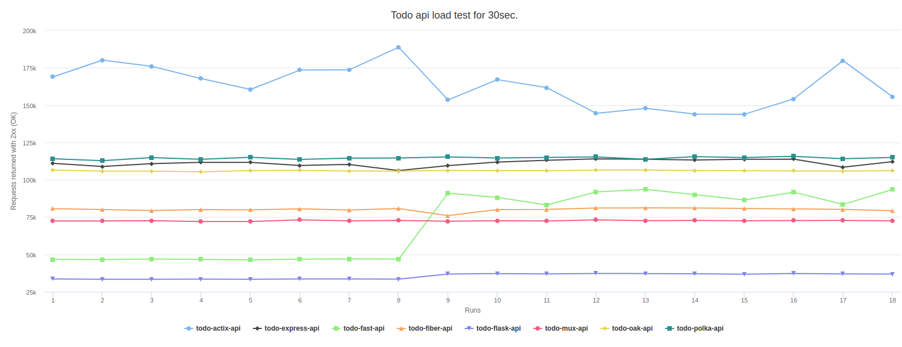

# Todo API load tests

Testing various api technologies and learning how to (properly) use them.

## Disclaimer

My experience with some of used technologies is limited. The scores might not reflect the full potential of the language or used library. Although these solutions seem reasonably simple there are still a lot of factors that influence the scores. All feedback, advice and contribution is welcome. I am interested in bringing all of used technologies to their maximum performance and increase my knowledge.

## Background

I primarily used nodejs and express to serve data to my frontends in the past. Over the time I have seen alternative solutions my clients used for developing the api's for web applications. I see a number of interesting alternatives to nodejs/express in 2020. My goal is to test populair approaches for building api's in the open source world, covering programming languages I already know (JavaScript, Python) and 2 new languages. I selected Go and Rust because these are modern languages and web oriented. I discarded Java, C++, PHP and many others based on my personal preference. During my investigation I came across discussions about the performance of various api libraries. That brought me to idea to create this repo with all api solutions I am interested in and to perform the same load tests on each of them. For load tests I used [autocannon](https://github.com/mcollina/autocannon).

Api server is an important part of the backend solution. Another important part is the database. I use the identical PostgreSQL docker container with all api. Postgres is well supported in all technologies I want to test and quite popular and performant.

## Used technologies

I have tested following api libraries:

- `Golang`: Basic [net/http/mux](https://golang.org/pkg/net/http/) and [fiber](https://github.com/gofiber/fiber) which seem to be fast and uses kind-of-express-way ideas.
- `Rust`: I started with [actix-web](https://github.com/actix/actix-web) which is popular and achieves the highest performance scores in the [benchmark](https://www.techempower.com/benchmarks/#section=data-r0&hw=ph&test=composite&a=2).
- `NodeJS`: I wanted to try [polka](https://github.com/lukeed/polka). It seem to be one of the fastest nodejs servers. [Express](https://expressjs.com/) is used as a benchmark to Polka.
- `Deno`: I am interested how Deno performs as well. It is new technology recently moved to version 1. Most popular choice medio 2020 seem to be [oak](https://github.com/oakserver/oak) http server.
- `Python`: I used [Flask](https://flask.palletsprojects.com/en/1.1.x/) first and then [FastApi](https://github.com/tiangolo/fastapi). FastApi is marked as the fastest python library for api's.

## Other interesting technologies not yet tested

- `dotnet core (C#)`: I need to further investigate appropriate approach and create api. It would be great if someone with the knowledge of C# could contribute this todo-api :-).

## What these load test results actually mean

Load tests of each solution give the `combined performance result` which include:

- the efficiency of used language (JavaScript, Python, Go, Rust)
- the efficiency of http library and the router (tls/https is not used)
- the efficiency of library used to communicate with PostgreSQL (db driver)
- the efficiency of machine running the load tests
- how well all of this performs in Docker containers (Linux Alpine or Debian OS) on the test machine

## Conclusion

I runned load tests on 3 machines (2 laptops and 1 desktop) for all api's. All machines use Linux OS (Ubuntu/Linux Mint). The results are saved in the separate branches with the name of the machine (eg. dell-xps-2018...). I noticed slight differences in the ranking between used hardware/machine. This is a bit surprising. It looks to me that different programming languages and maybe(?) libraries utilize specific hardware better. In addition, it could be that my knowledge of specific library is limited and has influence on the scores. As an example, see the image below where the performance of FastApi significantly improves (run 9+) after tweaking api for the number of workers used on the specific machine (dell-xps-2018). Fluctuations in actix-api are also partially caused by experimenting with the number of used workers. I noticed that different number of workers produces the highest score on different machines/hardware.

The absolute scores/numbers per machine are different of course, but `rust api using actix-web is clearly the fastest and python/flask api is the slowest on all tested machines`. NodeJS (polka, express), Deno (oak) and Golang api's (fiber and standard http/mux) are in the middle of the chart. Surprisingly Python FastAPI seem to be performing very close to Golang and NodeJS/Deno api's after I optimized the number of workers. There might be some room to improve performance of Golang api's too but my knowledge of Golang at this moment is fairly limited.

The scores from my dell-xps-2018 laptop are shown in the image below. An interactive version of this chart with more scores is available on `http://localhost:3000` (NextJS app) after runing `npm run dev` in the tests folder. Of course this means that you first need to clone this repo locally on your machine :-).
<br/><br/>



<br/><br/>

Based on the load tests outcomes and my experience trying new languages Golang and Rust I decided to invest more time in learning Rust rather than Golang. But I must admit that Golang seem to be easier to learn and faster in compiling than Rust.

# Development

This repo requires `docker and docker-compose` to run todo api's. For running load test and viewing simple table results you need `nodejs and npm`.

Running the load tests for the first time will require more time than the subsequent runs because all docker images need to be downloaded to your local machine.

The easiest way to run load tests on Linux/Mac is to use test-round.sh bash script. The script will create required containers in the background, run the test and then cleanup containers and the volumes used. You might need to make the script executable first.

```bash
# make executable
sudo chmod +x test-round.sh
```

## How this repo works

Each todo* folder contains complete api solution. All api's are functionally identical. They perform simple CRUD operations on Postgres database (todo_db). Each api folder has readme file where you can read how to start the api and run load test.

1. install npm dependencies for load tests and test report webpage.

```bash
# go to tests folder
cd tests
# install dependencies
npm install
# go back to root
cd ../
```

2. run tests using test-round.sh bash script (`Linux/MacOS only`): this script will run one round of 30 sec. load tests for all api's. You should run at least 3-5 rounds to have more reliable results for your machine.

```bash
# run test-round shell script (linux/MacOS)
./test-round.sh
```

## Contribution

All contributions are more than welcome as I am interested in bringing all of the used technologies to maximum performance and increase my knowledge.

If you want to contribute the scores of your machine please do so. I can create a new branch with your machine name. Based on my experience with running the api's on three different machines I expect that results on some other machines (and OS-es) could be quite different.
