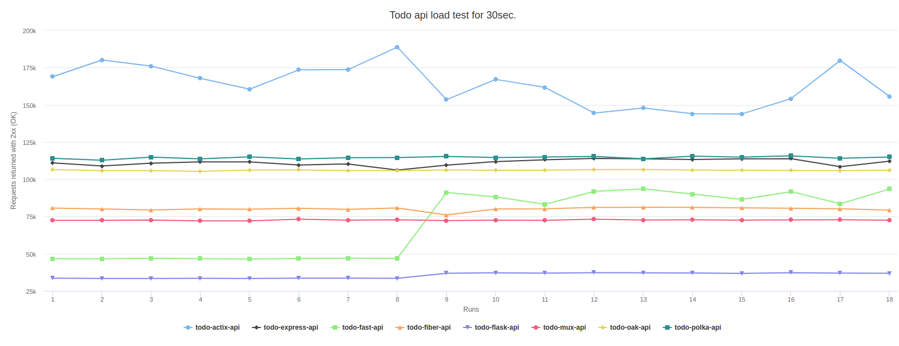

# Todo API tests

Testing techologies and learning to use them.

For quite some time I was primarily using nodejs and express to serve data to my frontends. Over the time I have seen a number of alternatives my clients used. I have noticed some chages in the landscape of used/preffered technologies for creating api's for the front-end applications. I focus on open source stack primarily and I might also look into Microsoft dotnet core as it is also open source, altough my knowledge of C# is quite limited. I see  number of interessting alternatives to nodejs/express avaliable in 2020. I was viewing lot of banchmarks lately and I got an idea to perform some load tests on each of the solutions I consider as attractive.

So, I created this repo to learn new technologies and test their performance. The api servers are important part of backend solition. Other important part is the database. To limit the variations I will use PostreSQL in all api solutions because it is well supported in all technologies I want to learn/test. Only with dotnet core I am thinking about using MSSQL. We will see :-).

## Dislaimer

`My knowledge in some of used techilogies might be limited and therefore the scores might not reflect the full potential of the language or used library. All contributions are more than welcome as I am interessted in bringing all of used techologies to maximum performace and increase my knowledge at the same time.`

## Used technologies

I have tested following technologies:

- Golang: There are multiple http servers I want to test from golang. Basic net/http and mux server and fiber which seem to be fast and uses kind-of-express-way routing idea.
- Rust: I started with actix http server which seem to be popular for rust.
- NodeJS: I want to try polka server. It seems to be one of the fastest nodejs http servers. Express is used as benhmark to Polka.
- Deno: I am interessted how deno perfomes as well. Most popular choice seem to be oak http server
- Python: I used Flask first and then FastApi as it seem to be marked as fastest python library for api's.
- dotnet core (C#): I need to further investigate approapriate approach and then create api. It would be great if someone with excellent knowledge of C# could contribute this api.

## Conclusion

I have runned load tests on 3 machines (2 laptops and 1 desktop) for all api's. The results are saved in the separate branches with the name of the machine (eg. dell-xps-2018...). There seem to be a differences in the ranking/score based on used machine and therefore the hardware. This is bit surprising to me. It seems to me like different programming languages and maybe the libraries utilize specific hardware (processor cores and available memory) better. It could be that my knowledge in some area is limited and influences the scores. As an example, see the image below where the performance of FastApi significanly improved (run 9+) after tweaking it for the number of workers used for specific machine, dell-xps-2018 for example. Fluctuations in actix-api are also due to experimenting with the number of used workers. Note! on the other machine different number of workers yield the highest scores.

The absolute scores per machine are different, of course, but `rust api using actix is clearly the fastest and python/flask api is the slowest on all tested machines`. NodeJS (polka, express), Deno (oak) and Golang api's (fiber and standard http/mux) are in the middle of the pack. Surprisingly Python FastAPI seem to be performing better than Golang api's after I optimized number of workers used. There might be some room to improve performance of Golang api's too but my knowledge of Golang at this moment is fairly limited.

The scores from my dell-xps-2018 machine are shown in the image bellow. An interactive version of this chart is avaliable on `http://localhost:3000` (NextJS app) after runing `npm run dev` in the tests folder.



## Requirements

This repo requires `docker and docker-compose` to run todo api's. For running load test and viewing simple table results you need `nodejs`.

## How this repo works

Each todo* folder contains complete api solution. All api's are functionally identical. They perform simple CRUD operations on Postgres database (todo_db). Each api folder has readme file where you can read how to start the api and run load test.

- install npm dependencies for load tests and test report webpage.

```bash
# go to tests folder
cd tests
# install dependencies
npm install
# go back to root
cd ../
```

- run tests using test-round.sh bash script (`Linux/MacOS only`): this script will run one round of 30 sec. load tests for all api's. You should run at least 3-5 rounds to have more reliable results for your machine.

```bash
# run test-round shell script (linux/MacOS)
./test-round.sh
```

## Contribution

All contributions are more than welcome as I am interessted in bringing all of used techologies to maximum performace and along the way increase my knowledge.

If you want to contribute the scores of your machine please do so. We can create new branch with your machine name. Based on my experience with running these api's on three different machines I suspect that the results on some other machines could be quite different, and that fact on its own is interessting.
